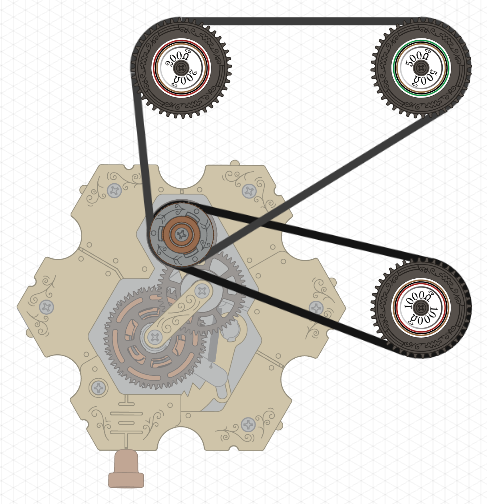

# Programmatic Spintronics

[Spintronics](https://upperstory.com/en/spintronics/) is an amazing product where kids of all ages can learn how circuits work using physical gears and chains. They offer a variety of challenges as well as an online [simulator](https://simulator.spintronics.com/) to test circuits before physically building them.

This repository attempts to create an API to programmatically generate these simulation files.

## Example

```rust
use spintronics::*;

fn main() {
    let mut circuit = Circuit::new();
o
    let motor = circuit.motor();
    let r1 = circuit.resistor(1000);
    let r2 = circuit.resistor(200);
    let r3 = circuit.resistor(500);

    circuit.connect(&[motor, r1]);
    circuit.connect(&[motor, r2, r3]);

    circuit.save("/home/user/test.spin");
}
```

## Output

Load the `/home/user/test.spin` simulation file in the simulator:


